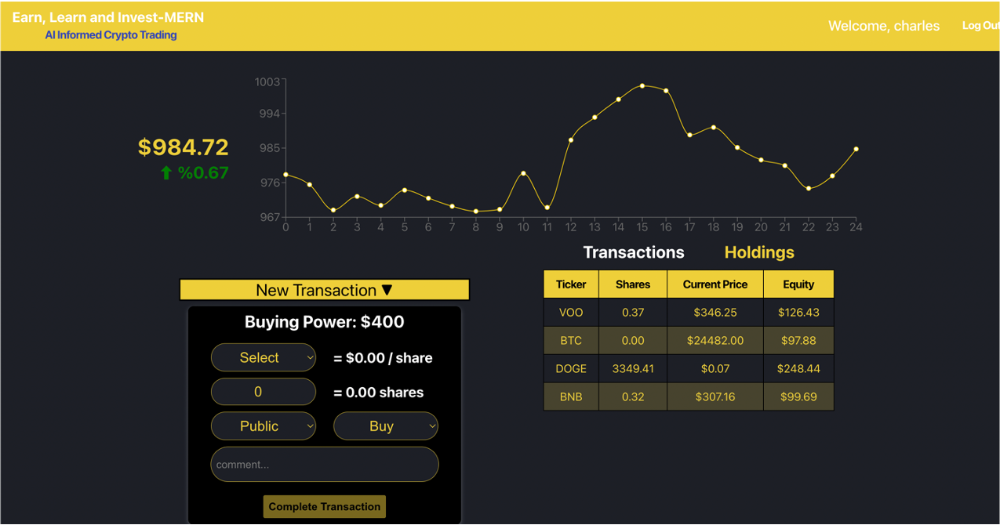
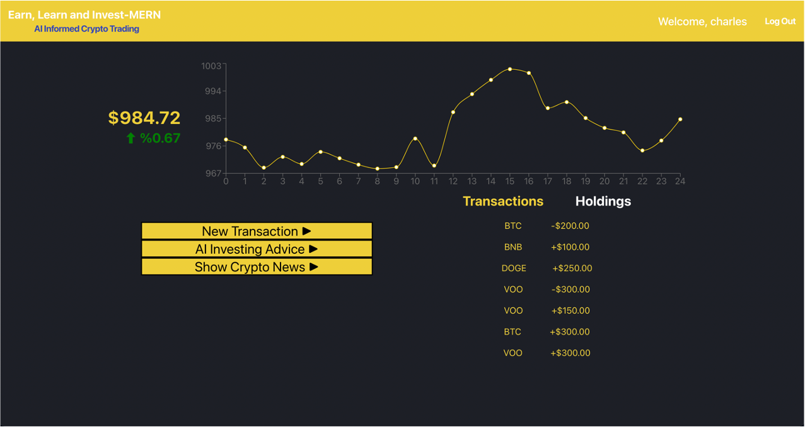
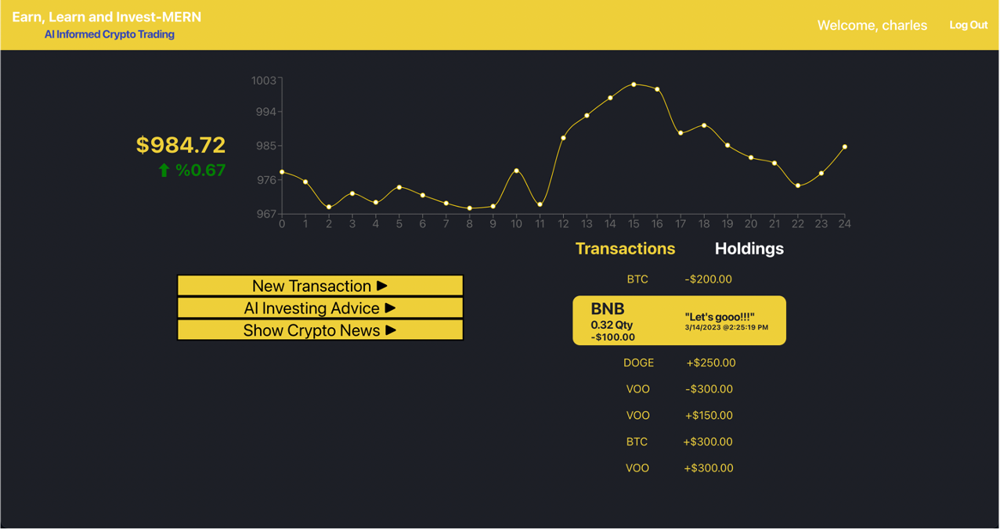

# Invest-MERN by Charles Grody

Earn, Learn, and Invest-MERN! Discover the Robinhood-inspired crypto trading app created by Charles Grody.

Visit the app: https://invest-mern.herokuapp.com/overview
#
## About
Invest-MERN is an easy-to-use trading platform that allows users to invest in cryptocurrencies and ETFs. The app offers curated lists of investment strategies to choose from, with live updating charts that track the performance of investments over time. Invest-MERN's tech stack uses MongoDB, Express, Node, and React, and pulls real-time data from various APIs to provide users with up-to-date information on crypto, stocks, and news. The app offers a range of features, including the ability to create transactions and view transaction history. More features are in development, such as a crypto news tab and a chatbot for risk-based strategies and investment advice. Invest-MERN aims to provide users with ease and confidence in their investments, helping them climb the ladder to financial success without any wasted time.
#
## Technologies Used
Invest-MERN is a web application based in that uses the MongoDB, Express, NodeJS, and React (MERN) stack. Additionally, Invest-MERN pulls real-time data for crypto, stock, and news data from the following APIs:

- Cryptocurrency API: https://www.coingecko.com/en/api/documentation
- Stock API: https://www.alphavantage.co/
- News API: https://newsapi.org/

## Screenshots

## Coming Soon
- AAU, I want to be able to see a percent change in each holding from my original investment.
- AAU, I want to be able to see timestamps on the x-axis instead of whole numbers.
- AAU, I want to see a smoothed chart on the year scale (maybe see weekly or monthly increments)
- AAU, when I sell off all holdings, the row for that holding disappers.
- AAU, when a transaction does not work, I want UI indicating that the transaction failed.
- AAU, I want a button where I can directly sell some or all of my holdings on the holdings table.
- AAU, I want to be able to repeat a transaction by clicking on it in the transaction list.
- AAU, I want to integrate the ChatGPT API to give users investing advice.
- AAU, I want historical data to take into account when I first purchased each asset instead of just a backwards extrapolation of my current portfolio value.

## Poem

Investing's easy, with no need to fear 
Invest-MERN's got your wealth path clear! 
Sign up or log in, get started today 
$1000 fake dollars, you're on your way! 

Trade cryptos and ETFs, curated lists 
Strategies to test, no need to resist 
Live updating charts, watch profits grow 
Track history, so you always know! 

MongoDB, Express, Node, and React 
Invest-MERN's tech stack is sure to impact 
Real-time data pulled from APIs galore 
Crypto, stocks, and news, and so much more! 
View history and details with ease 
Invest-MERN makes it all a breeze! 

Invest your time, watch wealth climb and climb 
Invest-MERN's the app that takes you there, no wasted time 
Ease and confidence, without a care 
Invest-MERN's the app, that'll take you to millionaire! 
#