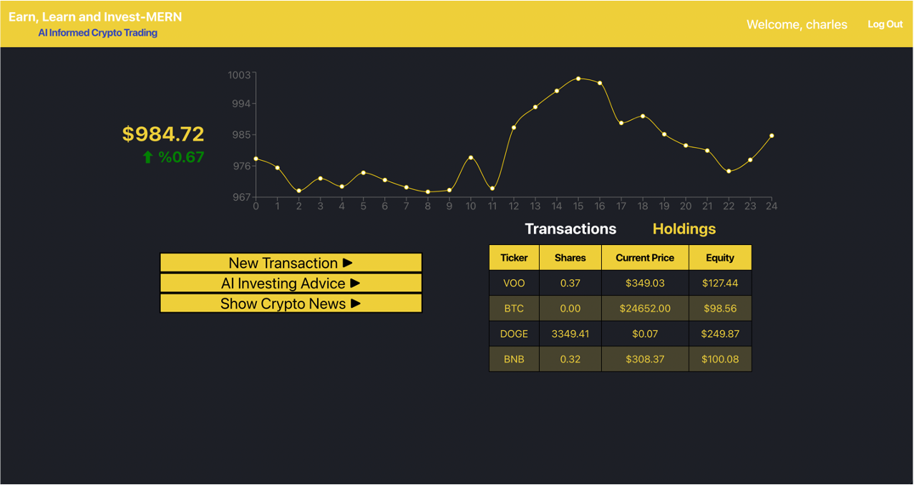

# Invest-MERN by Charles Grody
Earn, Learn, and Invest-MERN
Robinhood Inspired Crypto Trading App
by Charles Grody
https://invest-mern.herokuapp.com/overview

# About
Do you ever look up at the stars ✨ and wonder if there is more to this universe?  Do you ever wish you could just drop everything and travel to exotic locations like Iceland, or Fiji, or Baltimore?  To set yourself on a path that solidifies your financial future and guaruntees you a chance to explore the depths of this world, look no further than Invest-MERN.

Invest-MERN is your one stop shop for crypto news, trading, and learning.  Simply sign up or login and we will gift you with $1,000 (fake) USD to trade with our curated list of cryptocurrencies and ETFs.  Without taking any actual financial risk, you can try out multiple investment strategies to see how you you can maximize your profits when you enter the market.  Invest-MERN's live updating chart will show your performance throughout the past 24 hours and the Holdings table will show the breakdown of each asset.  Invest-MERN also keepS track of your transaction history so you don't have to!  You can even leave yourself notes when filling out a new transaction form to remind yourself for later why you made a specific transaction.

# Technologies Used
Invest-MERN is a web application based in that uses the mongoDB, Express, NodeJS, and React (MERN) stack.
Additionally, Invest-MERN pulls real time data for crypto, stock, and news data from the following APIs:
Cryptocurrency API: https://www.coingecko.com/en/api/documentation
Stock API: https://www.alphavantage.co/
News API: https://newsapi.org/

# Screenshots

# Coming Soon
Excited about investing but not sure where to start! Invest-MERN will still be your one stop shop for investing and education.  Our crypto news tab will have all the latest information for world of finance and crypto currency.  Not a big reader? No worries!  You can ask our ChatGPT powered chat bot advice on which investment strategies will work best with your risk tolerance! 